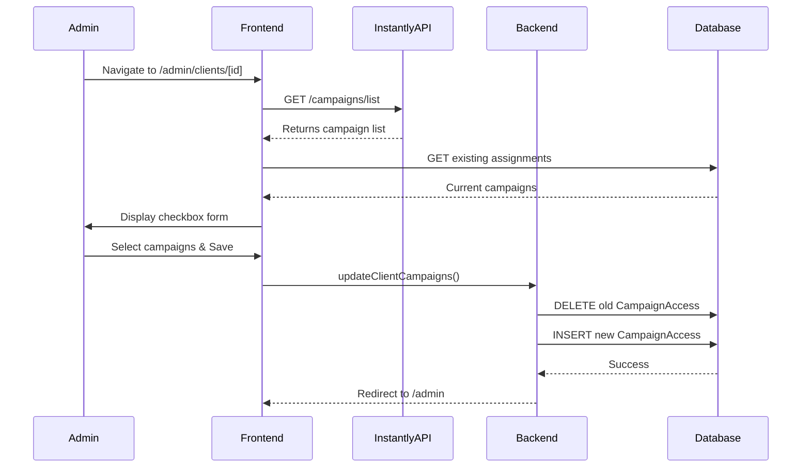
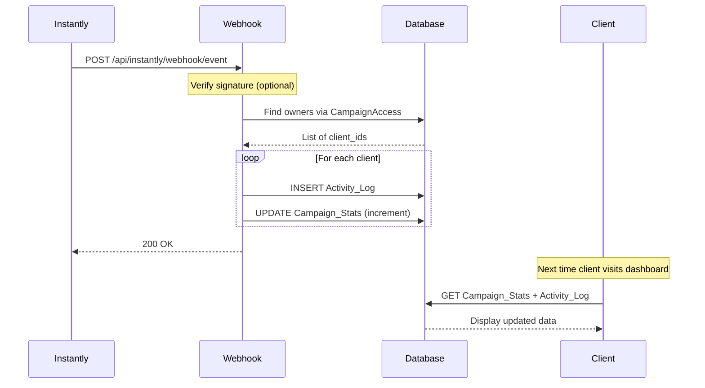
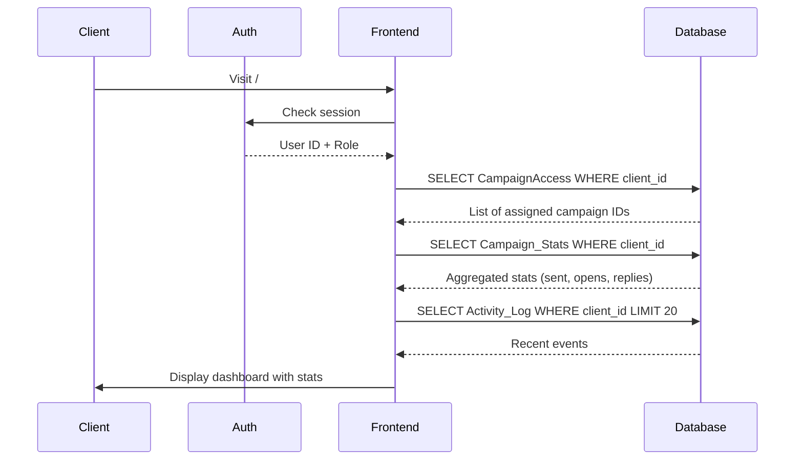

# Client Portal - API & Data Flow Diagram

## System Architecture Overview

```
┌─────────────────────────────────────────────────────────────────────┐
│                         INSTANTLY.AI                                 │
│                    (External Email Platform)                         │
└──────────────┬────────────────────────────────┬─────────────────────┘
               │                                │
               │ 1. Fetch Campaigns             │ 2. Send Events
               │ (Admin Action)                 │ (Webhooks)
               ▼                                ▼
┌──────────────────────────┐      ┌──────────────────────────────────┐
│  GET /campaigns/list     │      │  POST /api/instantly/webhook     │
│  (Instantly API)         │      │  (Our Webhook Endpoint)          │
└──────────┬───────────────┘      └─────────────┬────────────────────┘
           │                                    │
           │                                    │
           ▼                                    ▼
┌─────────────────────────────────────────────────────────────────────┐
│                         OUR BACKEND                                  │
│                      (Next.js Server)                                │
└──────────────┬──────────────────────────────────┬───────────────────┘
               │                                  │
               │ 3. Store Data                    │ 4. Update Stats
               ▼                                  ▼
┌─────────────────────────────────────────────────────────────────────┐
│                    PostgreSQL DATABASE                               │
│  ┌──────────┐  ┌────────────────┐  ┌──────────────┐  ┌────────────┐│
│  │  Client  │  │ CampaignAccess │  │Campaign_Stats│  │Activity_Log││
│  └──────────┘  └────────────────┘  └──────────────┘  └────────────┘│
└──────────────┬──────────────────────────────────┬───────────────────┘
               │                                  │
               │ 5. Query Data                    │ 6. Display Stats
               ▼                                  ▼
┌─────────────────────────────────────────────────────────────────────┐
│                         FRONTEND                                     │
│  ┌──────────────────┐              ┌──────────────────────┐         │
│  │  Admin Dashboard │              │  Client Dashboard    │         │
│  │   /admin         │              │   /                  │         │
│  └──────────────────┘              └──────────────────────┘         │
└─────────────────────────────────────────────────────────────────────┘
```

---

## Data Flow by User Action

### 📊 **Flow 1: Admin Assigns Campaign to Client**



**API Endpoints Involved:**
1. **External**: `GET https://api.instantly.ai/api/v2/campaigns/list`
   - Returns: List of all campaigns from Instantly.ai
   - Used by: Admin when assigning campaigns

2. **Internal**: Server Action `updateClientCampaigns()`
   - Input: `clientId`, `campaignIds[]`
   - Database: Updates `CampaignAccess` table
   - Result: Client now has access to selected campaigns

---

### 📧 **Flow 2: Instantly.ai Sends Event (Email Sent/Opened/Reply)**



**API Endpoints Involved:**
1. **External Webhook**: `POST /api/instantly/webhook/event`
   - Input: `{event_type, campaign_id, lead_email, message_body}`
   - Processing:
     - Find all clients assigned to `campaign_id`
     - Log event to `Activity_Log`
     - Increment counters in `Campaign_Stats`

---

### 👥 **Flow 3: Client Views Dashboard**



**Data Retrieved:**
1. **CampaignAccess**: Which campaigns the client can see
2. **Campaign_Stats**: Aggregated numbers (emails sent, open rate, etc.)
3. **Activity_Log**: Recent events (replies, opens)

---

## Database Table Relationships

```
┌─────────────┐
│   Client    │
│ (Users)     │
│             │
│ - id        │◄──────────┐
│ - email     │           │
│ - role      │           │
└─────────────┘           │
       │                  │
       │                  │
       │ 1:N              │ N:1
       │                  │
       ▼                  │
┌──────────────────┐      │
│ CampaignAccess   │      │
│ (Assignments)    │      │
│                  │      │
│ - client_id      │──────┘
│ - campaign_id    │
│ - campaign_name  │
└──────────────────┘
       │
       │ Links to Instantly campaign
       │ (No FK, external ID)
       │
       
┌─────────────┐
│   Client    │
└──────┬──────┘
       │ 1:N
       │
       ▼
┌──────────────────┐
│ Campaign_Stats   │
│ (Aggregated)     │
│                  │
│ - client_id      │
│ - emails_sent    │
│ - opens          │
│ - replies        │
└──────────────────┘

┌─────────────┐
│   Client    │
└──────┬──────┘
       │ 1:N
       │
       ▼
┌──────────────────┐
│  Activity_Log    │
│  (Events)        │
│                  │
│ - client_id      │
│ - event_type     │
│ - lead_email     │
│ - timestamp      │
└──────────────────┘
```

---

## Key API Endpoint Summary

### **External APIs (Instantly.ai)**

| Endpoint | Method | Purpose | Used By |
|----------|--------|---------|---------|
| `/campaigns/list` | GET | Fetch all campaigns | Admin assigning campaigns |

### **Internal APIs (Our Backend)**

| Endpoint/Action | Type | Purpose | Input | Output |
|-----------------|------|---------|-------|--------|
| `createClient()` | Server Action | Create new client user | email, password | Client record |
| `updateClientCampaigns()` | Server Action | Assign campaigns to client | clientId, campaignIds[] | Updated CampaignAccess |
| `/api/instantly/webhook/event` | POST | Receive Instantly events | event data | Updated stats |
| `/api/auth/[...nextauth]` | POST | User login | email, password | Session token |

---

## Data Update Flow

### When a campaign gets a reply:

1. **Instantly.ai** → Sends webhook to `/api/instantly/webhook/event`
2. **Webhook Handler** → Looks up `campaign_id` in `CampaignAccess` table
3. **Find Owners** → Gets all `client_id`s who have access to this campaign
4. **Update Database** (for each owner):
   - **Activity_Log**: INSERT new row (event_type: "reply_received")
   - **Campaign_Stats**: UPDATE existing row (replies = replies + 1)
5. **Client Views Dashboard** → Queries updated `Campaign_Stats` and `Activity_Log`

---

## Quick Reference: "Who sees what?"

### Admin sees:
- All clients (via Database query)
- All Instantly campaigns (via Instantly API)
- Can create assignments (via Database write)

### Client sees:
- Only campaigns in `CampaignAccess` WHERE `client_id = theirs`
- Only stats in `Campaign_Stats` WHERE `client_id = theirs`
- Only events in `Activity_Log` WHERE `client_id = theirs`

---

## Environment Variables & Their Purpose

| Variable | Used By | Purpose |
|----------|---------|---------|
| `DATABASE_URL` | Prisma | Connect to PostgreSQL |
| `INSTANTLY_API_KEY` | `lib/instantly.ts` | Fetch campaigns from Instantly |
| `INSTANTLY_WEBHOOK_SECRET` | `webhook/route.ts` | Verify webhook signatures |
| `NEXTAUTH_SECRET` | NextAuth | Encrypt session tokens |
| `NEXTAUTH_URL` | NextAuth | OAuth callback URL |

---

*This diagram shows the complete data flow and API relationships in the Client Portal.*
